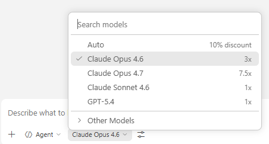

# はじめに — Todo アプリ開発体験ガイド

このワークスペースは、AI エージェント（GitHub Copilot）と一緒に **ゼロから Todo アプリを作る** 体験環境です。

作成するアプリは、Gmail からメールの内容をもとに予定を抽出し、Google Calendar に自動登録するものです。

---

## 必要なもの

| 何が必要？ | 説明 |
| --- | --- |
| **パソコン** | Windows または Mac |
| **VS Code** | エディタ（[ダウンロード](https://code.visualstudio.com/)） |
| **GitHub Copilot** | VS Code の拡張機能（有料プランが必要です） |
| **Google アカウント** | Gmail と Google Calendar を使います |

> 💡 開発ツール（Node.js、Git など）はこの体験の中でインストールします。最初から入っていなくても大丈夫です。

---

## ステップ 1：リポジトリをクローンして VS Code で開く

1. ターミナル（Windows: PowerShell、Mac: Terminal.app）を開きます
2. 好きな場所に移動して、以下のコマンドを実行します：

   ```bash
   git clone https://github.com/TsuyoshiUshio/buka-samples.git
   ```

3. クローンしたフォルダから VS Code を開きます：

   ```bash
   code buka-samples
   ```

4. VS Code が開いたら、ターミナルを開きます（`Ctrl + @` / Mac: `` Ctrl + ` ``）

> 💡 `git` コマンドが見つからない場合は、先に [Git](https://git-scm.com/) をインストールしてください。
> `code` コマンドが見つからない場合は、VS Code を起動して `Ctrl+Shift+P`（Mac: `Cmd+Shift+P`）→「Shell Command: Install 'code' command in PATH」を実行してください。

---

## ステップ 2：AI モデルを設定する

Copilot チャットで最高の体験を得るために、**Claude Opus 4.6 以降** のモデルを選択してください。

### 設定方法

1. VS Code の左サイドバーで **Copilot チャット**（💬 アイコン）を開きます
2. チャット入力欄の下にあるモデル選択ドロップダウンをクリックします
3. **「Claude Opus 4.6」** またはそれ以降のバージョンを選択します



> ⚠️ モデルが一覧に表示されない場合は、Copilot の契約プランをご確認ください。
> Claude Opus 4.6 は Copilot Pro / Business / Enterprise プランで利用できます。

---

## ステップ 3：開発環境をセットアップする

チャットで `/setup` と入力すると、AI がすべての準備を手伝ってくれます。

`/setup` がやってくれること：

1. **AI モデルと設定の確認** — Claude Opus 4.6 が選択されているか確認し、操作の自動承認（Auto-Approve）を設定します
2. **言語の確認** — 日本語で進めてよいか確認します
3. **ツールのチェック** — パソコンに必要なソフトが入っているか確認し、足りなければインストールを提案します
4. **Google API の設定** — Gmail と Google Calendar を使うための設定を、一歩ずつ対話形式でガイドします
5. **プロジェクトの初期化** — TypeScript などの開発に必要なパッケージをインストールします

AI が各ステップで「次はこれをしてください」と教えてくれるので、指示に従うだけで OK です。

> 💡 Google の認証情報は、ワークスペースの **外** の安全な場所（`~/.todo-app/`）に保存されます。
> これにより、AI がうっかり認証情報を見てしまうことを防いでいます。

---

## ステップ 4：開発を始める

準備ができたら、チャットでやりたいことを伝えてください！

### おすすめの始め方

1. まず `/plan-checklist` と入力して、やることリストを作ります
2. 次に `/dev-tdd` と入力して、テスト駆動で開発を進めます

### 会話の例

```text
あなた: Gmail からメールを取得する機能を作りたい
AI: わかりました！まずテストから書きましょう。メールの取得で何を確認したいですか？
```

---

## 使えるコマンド一覧

チャットで `/` を入力すると、以下のコマンドが使えます：

| コマンド | 説明 |
| --- | --- |
| `/setup` | 開発環境のセットアップ（最初に1回実行） |
| `/plan-checklist` | 作業前にやることリストを作成 |
| `/dev-tdd` | テスト駆動開発で機能を実装 |
| `/cleanup` | 完了したチェックリストファイルを整理 |
| `/help` | 困ったときのトラブルシューティング |
| `/skill-creator` | 新しい AI スキルを作成 |

---

## 困ったときは

チャットで `/help` と入力して状況を伝えると、AI がトラブルシューティングを手伝ってくれます。

| 状況 | 対処法 |
| --- | --- |
| コマンドが動かない | `/setup` を再実行して環境を確認 |
| テストが通らない | AI に「テストが失敗しています。原因を調べてください」と伝える |
| よくわからないエラー | エラーメッセージをそのままチャットに貼り付ける |
| 最初からやり直したい | AI に「この機能をやり直したい」と伝える |

---

## 💡 Tips：うまくいかないときの心得

### 画面や手順が README と違う場合

Google Cloud Console や VS Code は頻繁にアップデートされるため、このガイドの説明と実際の画面が異なることがあります。
**焦らなくて大丈夫です。** 画面のスクリーンショットを撮って、チャットに貼り付けて「この画面で次に何をすればいい？」と聞いてください。AI が最新の画面をもとに案内してくれます。

**スクリーンショットの撮り方：**

| OS | 操作 | 説明 |
| --- | --- | --- |
| **Windows** | `Win + Shift + S` | 範囲を選択してスクリーンショットを撮影。クリップボードにコピーされるので、チャットに `Ctrl + V` で貼り付け |
| **Mac** | `Cmd + Shift + 4` | 範囲を選択してスクリーンショットを撮影。デスクトップに保存されるので、チャットにドラッグ＆ドロップ |
| **Mac** | `Cmd + Ctrl + Shift + 4` | 範囲を選択し、クリップボードにコピー。チャットに `Cmd + V` で貼り付け |

### AI が長時間（10分以上）反応しない場合

エージェントが何かに詰まっている可能性があります。

1. **Stop ボタン**（チャットの ■ アイコン）を押して、いったん止めてください
2. 「何で詰まっていますか？状況を教えてください」と聞いてください
3. それでも解決しない場合は、**別のモデルを試してください**（チャット下部のモデル選択で切り替え）。モデルによって得意・不得意があるので、別の視点で解決できることがあります

### その他の心得

- **エラーが出たら、まずそのまま貼る** — エラーメッセージを自分で解読しようとしなくて OK です。そのままチャットに貼れば AI が読み解きます
- **「わかりません」と言っていい** — AI は質問に答えるのが仕事です。遠慮なく聞いてください
- **小さく進める** — 一度に大きなことをやろうとせず、1つずつ機能を作っていくのがコツです

---

## このワークスペースの構成

```text
todo/
├── README.md                     ← このファイル
├── AGENTS.md                     ← AI への指示書（自動で読まれます）
├── .gitignore                    ← Git に含めないファイルの設定
└── .github/
    ├── prompts/                  ← AI への作業指示（/コマンド）
    │   ├── plan-checklist.prompt.md
    │   ├── dev-tdd.prompt.md
    │   ├── cleanup.prompt.md
    │   └── help.prompt.md
    ├── instructions/             ← 共通ルール（AI が自動で参照）
    │   ├── checklist-workflow.instructions.md
    │   ├── tdd-workflow.instructions.md
    │   └── security.instructions.md
    └── skills/                   ← AI のスキル
        ├── setup/                ← /setup で使う環境構築スキル
        └── skill-creator/        ← 新しいスキルを作るスキル
```

---

楽しんでください！ 🎉
